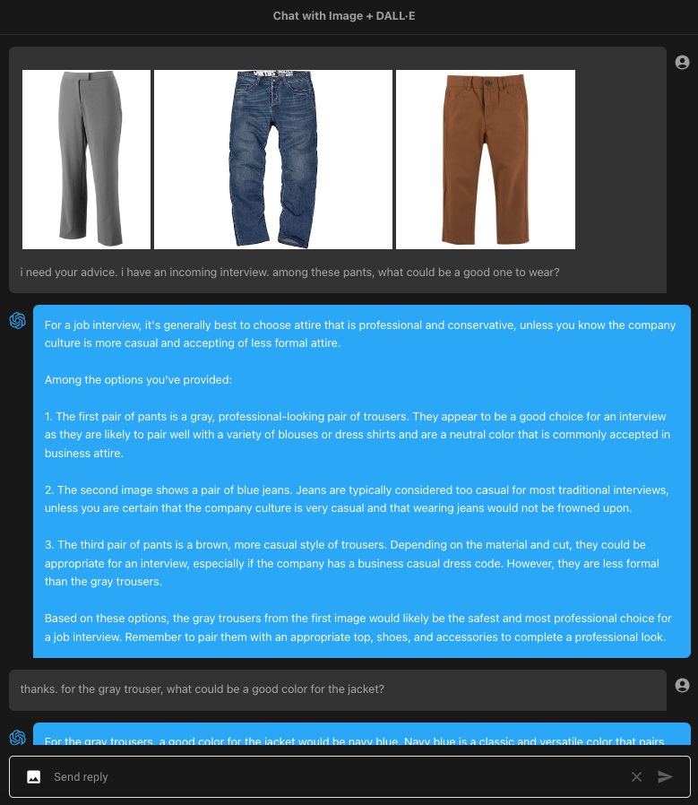
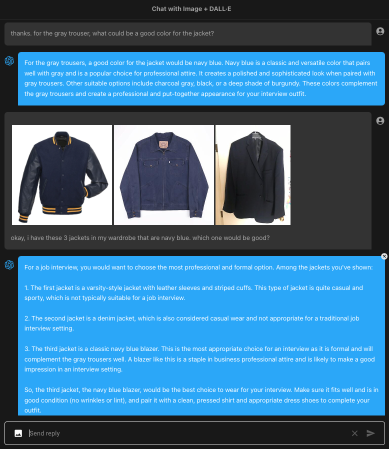
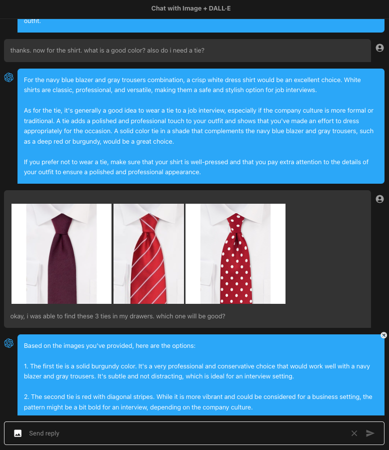
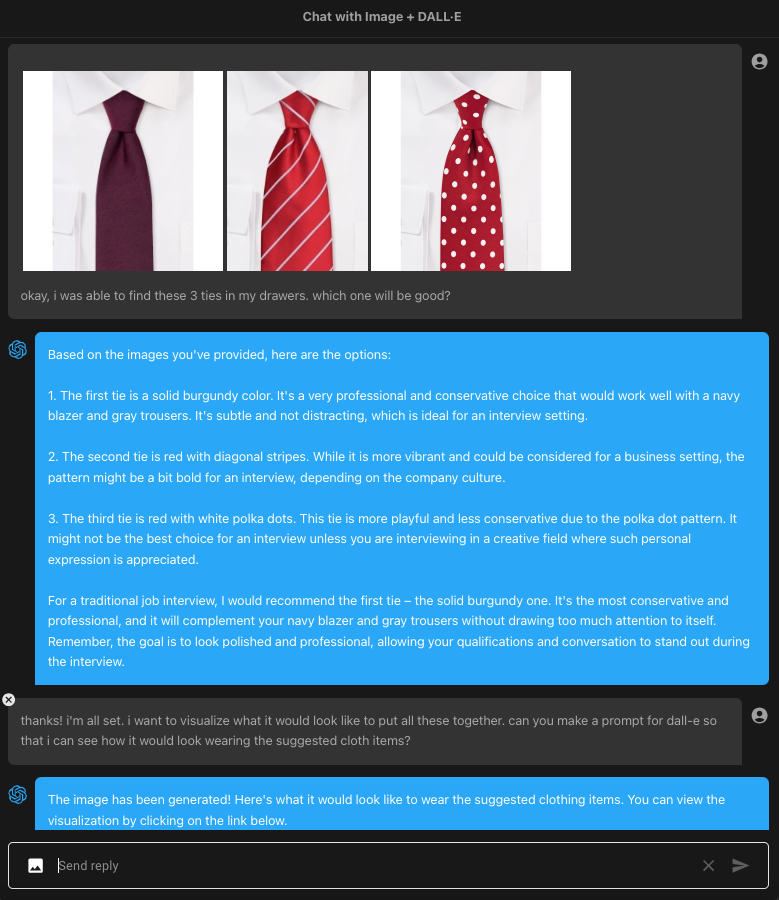
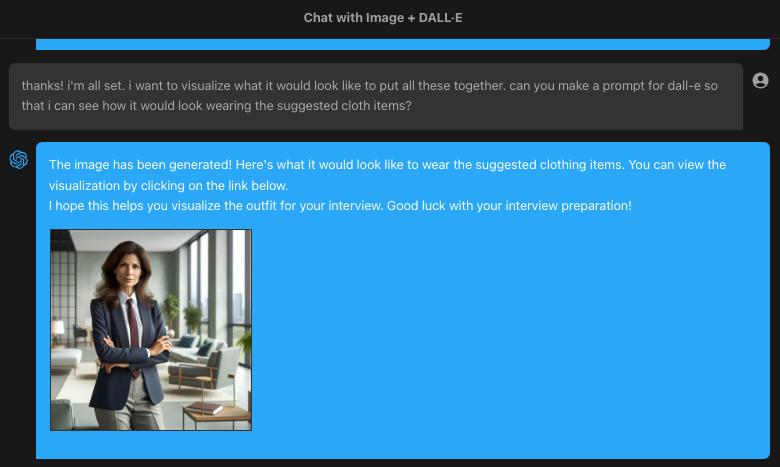
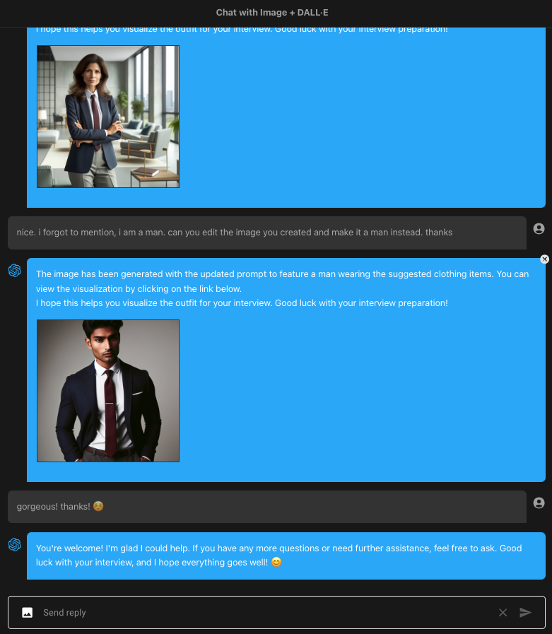

Food GPT
=====

v0.0.1

This project integrates OpenAI's [GPT-4 Vision](https://openai.com/blog/chatgpt-can-now-see-hear-and-speak), with advanced image recognition capabilities, and [DALL·E 3](https://openai.com/dall-e-3), the state-of-the-art image generation model, with the [Chat completions API](https://platform.openai.com/docs/guides/gpt/chat-completions-api). This powerful combination allows for simultaneous image creation and analysis.


**Updated**: Using [v4.19.1 OpenAI Node module](https://www.npmjs.com/package/openai)

# DALL·E 3

For [DALL·E 3 image creation](https://platform.openai.com/docs/guides/images/introduction?context=node), we will need to trigger the function call `create_image_dall-e`.

```javascript
{
    "name": "create_image_dall-e",
    "description": "Create images in DALL-E 3 based on prompts provided",
    "parameters": {
        "type": "object",
        "properties": {
            "items": {
                "type": "array",
                "description": "List of prompts that the user selected",
                "items": {
                    "type": "object",
                    "properties": {
                        "prompt": {
                            "type": "string",
                            "description": "The prompt based from user input"
                        },
                        "size": {
                            "type": "string",
                            "description": "The size of the image, use the default if the user does not provide any",
                            "default": "1024x1024",
                            "enum": [
                                "1024x1024",
                                "1024x1792",
                                "1792x1024"
                            ]
                        },
                        "quality": {
                            "type": "string",
                            "description": "The quality of the image",
                            "default": "standard",
                            "enum": [
                                "standard",
                                "hd"
                            ]
                        }
                    },
                    "required": ["prompt", "size", "quality"]
                }
            }
        },
        "required": ["items"]
    }
}
```

Here is the sample output

```javascript
{
  items: [
    {
      prompt: 'Creamy tomato mushroom pasta with fusilli, garnished with fresh herbs',
      size: '1024x1024',
      quality: 'standard'
    }
  ]
}
```

After receiveing the generated image url from the API, we will then save a copy in our [/public/uploads](/public/uploads/) directory.

```javascript
let image_list = await Promise.all(
    Array.from(image_result).map(async (img) => {
        
        const filename = `tmp-${Date.now()}`
        let filepath = path.join('public', 'uploads', filename)

        const data_response = await fetch(img.url)

        try {

            await streamPipeline(data_response.body, fs.createWriteStream(filepath))

            return {
                url: `/uploads/${filename}`,
                alt: `${img.prompt}`
            }

        } catch(error) {

            console.log(name, error)

            return null

        }

    })
)
```

Now, when we submit the result back to **Chat Completions API**, we will not be including this data.
We will just send the status and message. We will directly send the image data as part of the response back to the client and let the client deal with it.


# GPT-4 Vision

For image analysis, we will be using the new [GPT-4 with Vision](https://platform.openai.com/docs/guides/vision)

In this application, we will send an image with a query for image analysis

The GPT-4V supports image input either via URL or Base64 image. If URL, we will need it hosted somewhere with https. But we are using relative paths!
No problem. We have all the image files saved in the `/public/uploads` directory.

When you send image with the query, we first upload the image and only send the relative url and base64 data with the query.

When you refer to an image from the conversation, we use the relative path to get to the image file and encode it to base64.

So, we are always sending base64 image data!

# Sample Conversation

Here is a sample conversation using image analysis and creation.



I uploaded 3 images of different pants and laid out a scenario and ask for fashion recommendation. So this will go straight to GPT-4V.

I then ask follow up question for color of jacket, it tells me the appropriate color. Based on this, I uploaded 3 jackets of that color and ask for suggestion.



Again, this will go straight to GPT-4V for analysis.

I ask for what color of the tie will be good for gray pants and navy blue jacket. It gave me two suggestions: deep red and burgundy. So, I again scoured the web for such ties, uploaded it and ask it which one will be good.





Okay, now we are all set. The wardrobe is complete. So I ask it to create the image of what I may look like wearing its fashion recommendation.

Under the hood, the function calling is triggered

```javascript
{
  items: [
    {
      prompt: 'A person wearing a navy blue blazer, gray trousers, a white dress shirt, and a solid burgundy tie. The person is standing in a professional setting.',
      size: '1024x1024',
      quality: 'standard'
    }
  ]
}
```

Here is the output

```javascript
{
  status: 'image generated',
  message: "Done! Here's the image you requested...",
  images: [
  {
    url: '/uploads/tmp-1700628156120-img-JjENGYQcLJ0q7E98XeRlUuQO.png',
    alt: 'A person wearing a navy blue blazer, gray trousers, a white dress shirt, and a solid burgundy tie. The person is standing in a professional setting.'
  }
]
}
```



We have requested for an image of the new recipe with base as red sauce.

```javascript
{
  items: [
    {
      prompt: 'Creamy tomato mushroom pasta with fusilli, garnished with fresh herbs',
      size: '1024x1024',
      quality: 'standard'
    }
  ]
}
```

And here is the output

```javascript
{
  status: 'image generated',
  message: 'Done! Here is the images you requested...'
}
summary {
  index: 0,
  message: {
    role: 'assistant',
    content: 'The image of the creamy tomato mushroom pasta with fusilli, garnished with fresh herbs, has been generated. Here is the image you requested:\n' +
      '\n' +
      '\n' +
      '\n' +
      'I hope you find this image helpful for visualizing the dish! If you have any other requests or need further assistance, feel free to ask.'
  },
  logprobs: null,
  finish_reason: 'stop'
}
images [
  {
    url: '/uploads/tmp-1703196684046-img-20rH8qnJHU0jBqwgW9McAOcM.png',
    alt: 'Creamy tomato mushroom pasta with fusilli, garnished with fresh herbs'
  }
]
```




# Setup

Clone the repository and install the dependencies

```sh
git clone https://github.com/supershaneski/chatgpt-with-image-sample.git myproject

cd myproject

npm install
```

Copy `.env.example` and rename it to `.env` then edit the `OPENAI_API_KEY` and use your own `OpenAI API key`.

```javascript
OPENAI_API_KEY=YOUR-OPENAI-API-KEY
```

Then run the app

```sh
npm run dev
```

Open your browser to `http://localhost:4000/` to load the application page.
