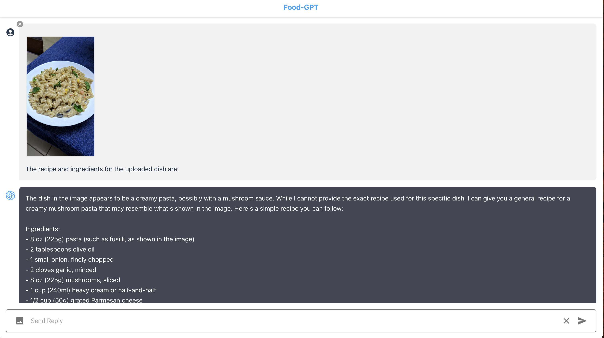
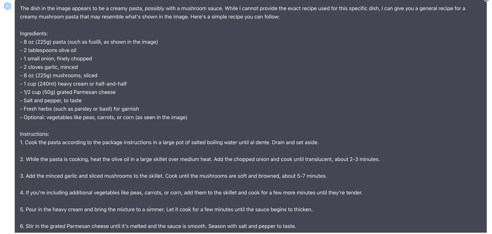
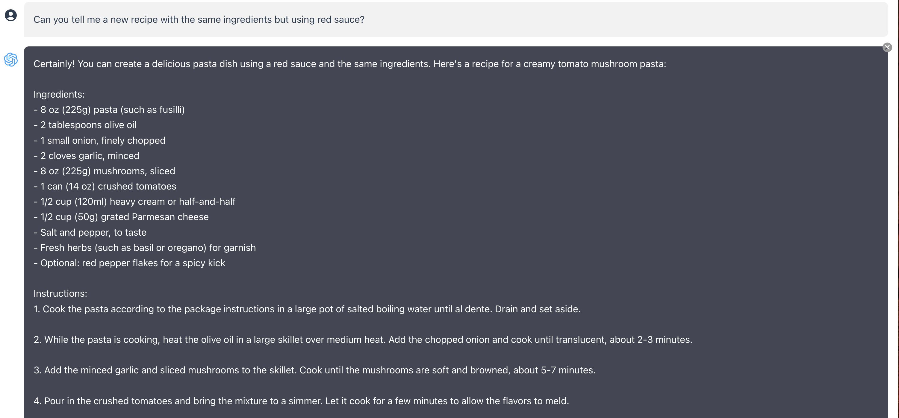
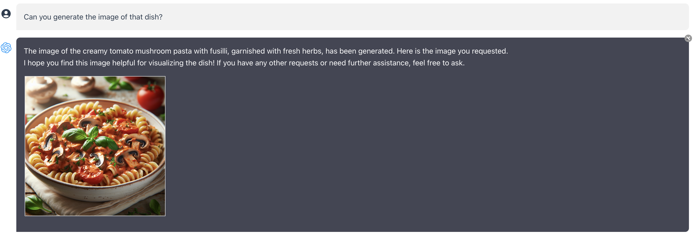

Flavorful GPT 
=====

[Demo](https://drive.google.com/file/d/1l3IMFmlXQaRcWETwTtN9GTaocFD3L96O/view?usp=drive_link)

v0.0.1

Meet your kitchen sidekick! This chatbot is here to make cooking a breeze. Ask anything, get endless ideas, and create delicious dishes effortlessly.
This project frontend interface is developed using React and integrated with OpenAI LLM API's like [GPT-4 Vision](https://openai.com/blog/chatgpt-can-now-see-hear-and-speak), with advanced image recognition capabilities, and [DALL·E 3](https://openai.com/dall-e-3), the state-of-the-art image generation model, with the [Chat completions API](https://platform.openai.com/docs/guides/gpt/chat-completions-api). This powerful combination allows for simultaneous image creation and analysis.


**Updated**: Using [v4.19.1 OpenAI Node module](https://www.npmjs.com/package/openai)

# DALL·E 3

For [DALL·E 3 image creation](https://platform.openai.com/docs/guides/images/introduction?context=node), we will need to trigger the function call `create_image_dall-e`.

```javascript
{
    "name": "create_image_dall-e",
    "description": "Create images in DALL-E 3 based on prompts provided",
    "parameters": {
        "type": "object",
        "properties": {
            "items": {
                "type": "array",
                "description": "List of prompts that the user selected",
                "items": {
                    "type": "object",
                    "properties": {
                        "prompt": {
                            "type": "string",
                            "description": "The prompt based from user input"
                        },
                        "size": {
                            "type": "string",
                            "description": "The size of the image, use the default if the user does not provide any",
                            "default": "1024x1024",
                            "enum": [
                                "1024x1024",
                                "1024x1792",
                                "1792x1024"
                            ]
                        },
                        "quality": {
                            "type": "string",
                            "description": "The quality of the image",
                            "default": "standard",
                            "enum": [
                                "standard",
                                "hd"
                            ]
                        }
                    },
                    "required": ["prompt", "size", "quality"]
                }
            }
        },
        "required": ["items"]
    }
}
```

Here is the sample output

```javascript
{
  items: [
    {
      prompt: 'Creamy tomato mushroom pasta with fusilli, garnished with fresh herbs',
      size: '1024x1024',
      quality: 'standard'
    }
  ]
}
```

After receiveing the generated image url from the API, we will then save a copy in our [/public/uploads](/public/uploads/) directory.

```javascript
let image_list = await Promise.all(
    Array.from(image_result).map(async (img) => {
        
        const filename = `tmp-${Date.now()}`
        let filepath = path.join('public', 'uploads', filename)

        const data_response = await fetch(img.url)

        try {

            await streamPipeline(data_response.body, fs.createWriteStream(filepath))

            return {
                url: `/uploads/${filename}`,
                alt: `${img.prompt}`
            }

        } catch(error) {

            console.log(name, error)

            return null

        }

    })
)
```

Now, when we submit the result back to **Chat Completions API**, we will not be including this data.
We will just send the status and message. We will directly send the image data as part of the response back to the client and let the client deal with it.


# GPT-4 Vision

For image analysis, we will be using the new [GPT-4 with Vision](https://platform.openai.com/docs/guides/vision)

In this application, we will send an image with a query for image analysis

The GPT-4V supports image input either via URL or Base64 image. If URL, we will need it hosted somewhere with https. But we are using relative paths!
No problem. We have all the image files saved in the `/public/uploads` directory.

When you send image with the query, we first upload the image and only send the relative url and base64 data with the query.

When you refer to an image from the conversation, we use the relative path to get to the image file and encode it to base64.

So, we are always sending base64 image data!

# Sample Conversation

Here is a sample conversation using image analysis and creation.



I uploaded an image of white cream sauce pasta and have requested it to let me know the ingredients as well the recipe to make the dish. So this will go straight to GPT-4V.

Then it has generated the response describing the ingredients and recipe for the dish



Next, I have requested it to generate a different recipe with the same ingredients and using red sauce as the base.
Now, this will go straight to GPT-3.5 for analysis.

```javascript
function call {
  index: 0,
  message: {
    role: 'assistant',
    content: "Certainly! You can create a delicious pasta dish using a red sauce and the same ingredients. Here's a recipe for a creamy tomato mushroom pasta:\n" +
      '\n' +
      'Ingredients:\n' +
      '- 8 oz (225g) pasta (such as fusilli)\n' +
      '- 2 tablespoons olive oil\n' +
      '- 1 small onion, finely chopped\n' +
      '- 2 cloves garlic, minced\n' +
      '- 8 oz (225g) mushrooms, sliced\n' +
      '- 1 can (14 oz) crushed tomatoes\n' +
      '- 1/2 cup (120ml) heavy cream or half-and-half\n' +
      '- 1/2 cup (50g) grated Parmesan cheese\n' +
      '- Salt and pepper, to taste\n' +
      '- Fresh herbs (such as basil or oregano) for garnish\n' +
      '- Optional: red pepper flakes for a spicy kick\n' +
      '\n' +
      'Instructions:\n' +
      '1. Cook the pasta according to the package instructions in a large pot of salted boiling water until al dente. Drain and set aside.\n' +
      '\n' +
      '2. While the pasta is cooking, heat the olive oil in a large skillet over medium heat. Add the chopped onion and cook until translucent, about 2-3 minutes.\n' +
      '\n' +
      '3. Add the minced garlic and sliced mushrooms to the skillet. Cook until the mushrooms are soft and browned, about 5-7 minutes.\n' +
      '\n' +
      '4. Pour in the crushed tomatoes and bring the mixture to a simmer. Let it cook for a few minutes to allow the flavors to meld.\n' +
      '\n' +
      '5. Stir in the heavy cream and grated Parmesan cheese. Let the sauce simmer for a few more minutes until it thickens slightly.\n' +
      '\n' +
      '6. Season the sauce with salt, pepper, and optional red pepper flakes for a spicy kick.\n' +
      '\n' +
      '7. Add the cooked pasta to the skillet with the sauce and toss to coat the pasta evenly.\n' +
      '\n' +
      '8. Serve the pasta hot, garnished with fresh herbs.\n' +
      '\n' +
      "This creamy tomato mushroom pasta is a flavorful alternative to the creamy white sauce version, and it's sure to be a hit at the dinner table!"
  },
  logprobs: null,
  finish_reason: 'stop'
}
```



Now I have requested to generate the image of the corresponding pasta. It triggers the dall-e function.
We have requested for an image of the new recipe with base as red sauce.

```javascript
{
  items: [
    {
      prompt: 'Creamy tomato mushroom pasta with fusilli, garnished with fresh herbs',
      size: '1024x1024',
      quality: 'standard'
    }
  ]
}
```

And here is the output

```javascript
{
  status: 'image generated',
  message: 'Done! Here is the images you requested...'
}
summary {
  index: 0,
  message: {
    role: 'assistant',
    content: 'The image of the creamy tomato mushroom pasta with fusilli, garnished with fresh herbs, has been generated. Here is the image you requested:\n' +
      '\n' +
      '\n' +
      '\n' +
      'I hope you find this image helpful for visualizing the dish! If you have any other requests or need further assistance, feel free to ask.'
  },
  logprobs: null,
  finish_reason: 'stop'
}
images [
  {
    url: '/uploads/tmp-1703196684046-img-20rH8qnJHU0jBqwgW9McAOcM.png',
    alt: 'Creamy tomato mushroom pasta with fusilli, garnished with fresh herbs'
  }
]
```




# Setup

Clone the repository and install the dependencies

```sh
git clone https://github.com/jg6660/foodGPT.git flavorfulGPT

cd flavorfulGPT

npm install
```

Copy `.env.example` and rename it to `.env` then edit the `OPENAI_API_KEY` and use your own `OpenAI API key`.

```javascript
OPENAI_API_KEY=YOUR-OPENAI-API-KEY
```

Then run the app

```sh
npm run dev
```

Open your browser to `http://localhost:4000/` to load the application page.
